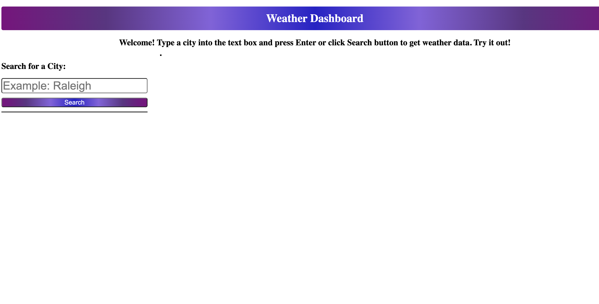
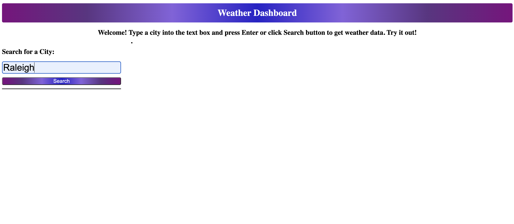
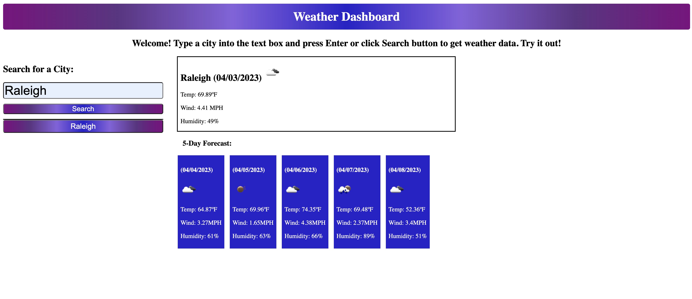
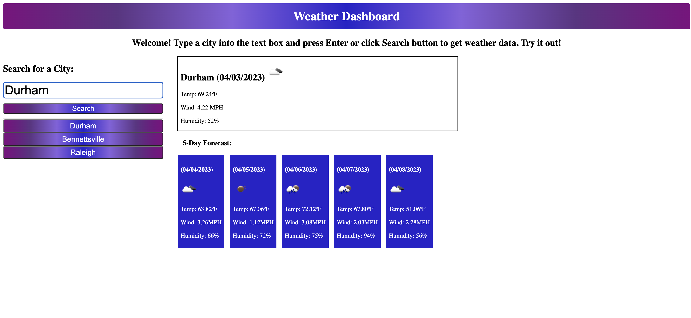

# Server-Side-APIs-Weather-Dashboard

## Description

The following application is called weather dashboard. It contains a form that allows users to input a city to retrieve weather data for current conditions and five-day forecast. Data is gathered from fetching from openweather API. The objective was to learn and understand how server-side APIs are used and to organize the data in a user-friendly way. The benefit of this challeneg is that the user is able to view the current and forecasted weather data to be able to plan ahead. Through much research, mistakes, & trial and error, the challenge taught how to call an API properly and be able to isolate specific data to present to the user. Another lesson learned was utilizing local storage to be able to create a search history list to be able to go back to submissions and regenerate the data.

## Table of Contents (Optional)

If your README is long, add a table of contents to make it easy for users to find what they need.

- [Usage](#usage)
- [Credits](#credits)
- [License](#license)

## Usage

Navigate to page, input a city in text box, hit search and display current and forecasted weather data. Screenshots provided below:

    

## Credits

Emmanuel Lakis - https://github.com/pexApred, Benicio Lopez - Tutor, Class Notes

## License

MIT License

Copyright (c) 2023 Emmanuel Lakis

Permission is hereby granted, free of charge, to any person obtaining a copy
of this software and associated documentation files (the "Software"), to deal
in the Software without restriction, including without limitation the rights
to use, copy, modify, merge, publish, distribute, sublicense, and/or sell
copies of the Software, and to permit persons to whom the Software is
furnished to do so, subject to the following conditions:

The above copyright notice and this permission notice shall be included in all
copies or substantial portions of the Software.

THE SOFTWARE IS PROVIDED "AS IS", WITHOUT WARRANTY OF ANY KIND, EXPRESS OR
IMPLIED, INCLUDING BUT NOT LIMITED TO THE WARRANTIES OF MERCHANTABILITY,
FITNESS FOR A PARTICULAR PURPOSE AND NONINFRINGEMENT. IN NO EVENT SHALL THE
AUTHORS OR COPYRIGHT HOLDERS BE LIABLE FOR ANY CLAIM, DAMAGES OR OTHER
LIABILITY, WHETHER IN AN ACTION OF CONTRACT, TORT OR OTHERWISE, ARISING FROM,
OUT OF OR IN CONNECTION WITH THE SOFTWARE OR THE USE OR OTHER DEALINGS IN THE
SOFTWARE.